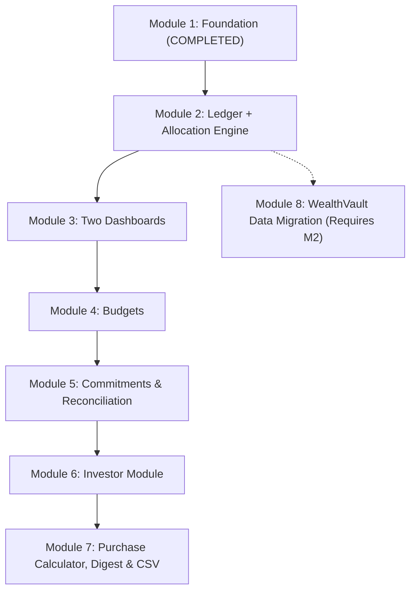

# Implementation Plan — Personal Finance Stewardship PWA

> **End-to-End Technical Execution Blueprint**  
> Companion to `PROGRESS.md`. Read this file alongside `PROGRESS.md` at the start of every module session.

---

## 1. Architectural Principles & Invariants

1. **Six-Bucket Waterfall:**
   - Inflows are split: Tithe (10% gross), Kingdom Investment (20% gross). Remainder (70% gross) becomes the base 100%, distributed: Savings (20%), Investment (20%), Charity (10%), Expenses (50%).
   - Tithe and Kingdom Investment are designated pass-through buckets (`is_pass_through = 1`). Payouts are recorded as standard `expense_debit` entries; a non-zero balance signifies a pending release, not an error.
2. **Per-Transaction Override:**
   - One-off custom splits set `transactions.is_override = 1` and `allocation_rule_version = NULL`. Individual bucket distributions are recorded in `allocation_runs`.
3. **Flexible vs. Fixed Category Sourcing:**
   - `Offering`: `bucket_is_flexible = 0`, defaulted directly to the `expense` bucket.
   - `Seed`: `bucket_is_flexible = 1`, `default_bucket_id = NULL`. UI mandates user selection of `chosen_bucket_id` at transaction entry.
4. **Append-Only Bucket Ledger:**
   - No mutable `balance` column exists on `allocation_buckets`. Live available balance is derived exclusively by summing ledger entries:
     $$\text{Balance} = \sum(\text{allocation\_credit} + \text{transfer\_in}) - \sum(\text{expense\_debit} + \text{transfer\_out}) \pm \text{manual\_adjustment}$$
   - Past transaction edits or deletions **never** mutate old records. They append compensating/reversal ledger entries and write to `transaction_audit_log`.
5. **Non-Isolated Budget Adherence %:**
   - Calculated as:
     $$\text{Adherence \%} = 100 - \max\left(0, \frac{\text{Total Actual} - \text{Total Planned}}{\text{Total Planned}} \times 100\right)$$
   - Must **always** be returned and displayed alongside the per-category variance table with the top 3 offenders highlighted—never as a standalone gamified score.
6. **Numbered D1 Migrations:**
   - Migrations are split into sequential files matching the build order (`worker/migrations/0001_foundation.sql`, `0002_ledger_allocation.sql`, etc.). No tables outside the active module's scope are created prematurely.

---

## 2. Full 8-Module Build Roadmap

---

### Module 1: Foundation (COMPLETED ✅)
- **Scope:**
  - Cloudflare D1 database `finance-app-db` and KV namespace `CACHE`.
  - Migration `worker/migrations/0001_foundation.sql`: `allocation_buckets`, `allocation_rules`, `categories`, `income_sources`, `accounts`, `auth_credentials`.
  - Seed Data: 6 buckets, Rule v1 (10/20/20/20/10/50), 13 categories (Seed flexible, Offering fixed), standard income sources.
  - Hono Worker: Base router, CORS, error handling, WebAuthn middleware with dev bypass (`x-dev-bypass: true`).
  - Endpoints: `GET /api/health`, `GET/POST /api/allocation-rules`, `GET /api/allocation-rules/current`, `GET/POST/PATCH /api/categories`, `GET/POST /api/income-sources`, `GET/POST /api/accounts`.
- **Traceability Rows:** 1, 7, 9, 10, 13.
- **Verification:** 12/12 passing Vitest tests; deployed live to Cloudflare Edge.

---

### Module 2: Ledger + Allocation Engine (NEXT TARGET)
- **Scope:**
  - Migration `worker/migrations/0002_ledger_allocation.sql`:
    - `transactions` (with `external_id UNIQUE`, `is_override`, `purpose_label`, etc.)
    - `allocation_runs` (record of applied split per bucket)
    - `bucket_ledger_entries` (append-only credits, debits, transfers, adjustments)
    - `bucket_transfers` (explicit bucket-to-bucket links)
    - `transaction_audit_log` (field-level change history)
  - Core Business Logic (`worker/lib/`):
    - `runAllocation(transaction, overrideSplit)`: Gross waterfall split, pass-through handling, override flag.
    - `recordExpense(transaction)`: Seed flexible bucket vs. Offering fixed expenses bucket debit.
    - `transferBetweenBuckets(...)`: Two-legged atomic transfer in a single D1 transaction.
    - `editTransaction(id, changes)`: Immutability enforcement via compensating/offsetting reversal entries.
    - Scalar live balance calculation helper.
  - Endpoints:
    - `GET /api/transactions` (filterable by date, category, bucket, direction, amount range; paginated)
    - `POST /api/transactions` (triggers allocation or expense debit)
    - `GET /api/transactions/:id`
    - `PATCH /api/transactions/:id` (audit log + ledger reversal)
    - `DELETE /api/transactions/:id` (reversal entries + audit log)
    - `GET /api/buckets` (returns all 6 buckets with live computed balances)
    - `GET /api/buckets/:id/ledger` (paginated bucket ledger journal)
    - `POST /api/buckets/transfer` (bucket-to-bucket movement)
    - `POST /api/buckets/adjust` (manual balance adjustments)
- **Traceability Rows:** 1, 2, 3, 4, 6, 8, 12, 26.
- **Test Invariants:**
  - Allocation splits sum strictly to 100% of inflow.
  - Bucket balance strictly equals $\sum(\text{credits}) - \sum(\text{debits}) \pm \text{adjustments}$.
  - Transfers generate equal and opposite entries atomically.
  - Transaction edits never mutate existing ledger rows; only offsetting entries are appended.

---

### Module 3: Two Dashboards (Financial Health vs. Money Movement)
- **Scope:**
  - Migration `worker/migrations/0003_dashboards.sql`:
    - `monthly_summaries` (`month`, `category_id`, `bucket_id`, `total_amount`, `refreshed_at`, `UNIQUE(month, category_id, bucket_id)`)
    - `net_worth_snapshots` (`date`, `total_assets`, `total_liabilities`, `net_worth`, `base_currency`)
    - `fx_rates` (`date`, `from_currency`, `to_currency`, `rate`, `UNIQUE(date, from_currency, to_currency)`)
  - Cloudflare Scheduled Cron Triggers:
    - Nightly job: recompute net worth snapshot and refresh `monthly_summaries`.
  - API Endpoints:
    - `GET /api/dashboard/health` (net worth trend, savings/invest rate, budget adherence summary, runway)
    - `GET /api/dashboard/ledger` (real-time bucket cards, daily inflow/outflow series, recent 10 transactions)
    - `GET /api/net-worth` & `POST /api/net-worth/snapshot`
  - Frontend PWA:
    - Mobile bottom nav / desktop side nav layout (Health, Ledger, Investor, Budgets, More).
    - Screen 1: Financial Health Dashboard.
    - Screen 2: Money Movement Dashboard.
    - Shared `<ChartCard>` (Chart.js) and `<BucketBadge>` components.
- **Traceability Rows:** 5, 11, 15, 28.

---

### Module 4: Budgets
- **Scope:**
  - Migration `worker/migrations/0004_budgets.sql`:
    - `budgets` (`id`, `month`, `category_id`, `planned_amount`, `UNIQUE(month, category_id)`)
  - Core Business Logic:
    - `getBudgetVariance(month)`: Category-level planned vs. actual from transactions.
    - `getOverallAdherence(month)`: Overall percentage paired with per-category breakdown.
  - Endpoints:
    - `GET /api/budgets?month=YYYY-MM` (planned vs. actual per category + overall adherence %)
    - `POST /api/budgets` (set/update planned amounts)
    - `GET /api/budgets/trend?from=YYYY-MM&to=YYYY-MM` (month-over-month adherence trend line)
  - Frontend:
    - Screen 5: Budgets (Month selector, paired adherence header, variance bars, planned-vs-actual chart, MoM trend line, "Copy last month" action).
- **Traceability Rows:** 16.

---

### Module 5: Goals, Liabilities, Recurring Transactions & Reconciliation
- **Scope:**
  - Migration `worker/migrations/0005_commitments.sql`:
    - `goals` (`name`, `target_amount`, `target_date`, `linked_bucket_id`)
    - `liabilities` (`name`, `type`, `principal`, `current_balance`, `interest_rate`, `minimum_payment`, `due_date`, `lender`)
    - `recurring_transactions` (`category_id`, `bucket_id`, `direction`, `amount`, `frequency`, `next_due_date`, `active`)
  - Core Business Logic:
    - `reconcileAccount(accountId, actualBalance, date)`: Flags variance between actual and computed balance.
    - Daily cron scan for recurring commitments due in $\le 3$ days.
  - Endpoints:
    - `GET/POST/PATCH /api/goals`
    - `GET/POST/PATCH /api/liabilities`
    - `GET/POST/PATCH /api/recurring`
    - `POST /api/accounts/:id/reconcile`
  - Frontend:
    - Screen 6: Goals (bucket-linked progress bars).
    - Screen 9: Liabilities (payment cards).
    - Account detail reconciliation UI.
- **Traceability Rows:** 23, 24, 25, 29.

---

### Module 6: Investor Module
- **Scope:**
  - Migration `worker/migrations/0006_investor.sql`:
    - `investments` (`type`, `symbol_or_name`, `market`, `quantity`, `cost_basis`, `current_value`, `strategy_id`, `account_id`)
    - `investment_price_updates` (`investment_id`, `date`, `price`, `source`)
    - `strategies` & `strategy_stages` (staged compounding templates)
  - Core Business Logic:
    - Manual NGX price entry journal (source = 'manual').
    - Live crypto/global equities price proxy with KV caching (TTL 15 min).
    - Staged compounding capital curve simulation:
      $$\text{Capital}_{k} = \text{Capital}_{k-1} \times (1 + \text{Return}_k)$$
  - Endpoints:
    - `GET/POST /api/investments`
    - `POST /api/investments/:id/price-update`
    - `GET /api/investments/live-prices?symbols=...`
    - `GET/POST /api/strategies`
    - `POST /api/strategies/:id/simulate`
  - Frontend:
    - Screen 7: Investor Module (NGX / Global / Crypto tabs, manual price modals, strategy simulator projection chart).
- **Traceability Rows:** 17, 18, 19, 20.

---

### Module 7: Purchase Calculator, Research Digest & CSV Import/Export
- **Scope:**
  - Migration `worker/migrations/0007_tools.sql`:
    - `purchase_calculations` (`item`, `cost`, `net_worth_at_time`, `ratio_pct`, `tier_result`, `date`)
    - `digest_items` (`topic`, `summary`, `source_url`, `read_status`)
    - `import_batches` (`file_name`, `row_count`, `status`, `error_log`)
  - Core Business Logic:
    - Ratio calculation: $\text{Ratio} = (\text{Cost} / \text{NetWorth}_{\text{snapshot}}) \times 100$.
    - 7-tier evaluation: Safe (<1%), Comfortable (<5%), Major (<10%), Good Reason (<20%), Call Family (<30%), Owns You (<=50%), Call Ancestors (>50%).
    - Weekly research digest Worker Cron Trigger calling Claude API.
    - Full CSV export generator (transactions, buckets, investments, budgets).
  - Endpoints:
    - `POST /api/purchase-calculator` & `GET /api/purchase-calculator/history`
    - `GET/PATCH /api/digest`
    - `GET /api/export?format=csv`
  - Frontend:
    - Screen 8: Purchase Calculator.
    - Screen 11: Research Digest.
    - Settings CSV export.
- **Traceability Rows:** 21, 22, 27.

---

### Module 8: WealthVault Data Migration
- **Scope:**
  - Prerequisite: Module 2 built and tested.
  - CSV Ingestion Engine:
    - Parses 19-column RFC 4180 CSV exported from WealthVault (`external_id`, `date`, `direction`, `subtype`, `amount`, `category`, `note`, `purpose_label`, `bucket`, `from_bucket`, `to_bucket`, `split_tithe` ... `split_expense`).
    - Maps historical IDs to `transactions.external_id` for idempotent deduplication.
    - Reconstructs `allocation_runs` from historical snapshot columns.
    - Appends matching historical `bucket_ledger_entries`.
    - Handles subtypes: `bucket_transfer` and `bucket_deploy`.
  - Endpoints:
    - `POST /api/transactions/import` (multipart upload, stores batch in D1)
    - `GET /api/imports/:id` (batch status and error logs)
  - Ledger Reconciliation:
    - Verifies that post-import bucket balances exactly match WealthVault totals with zero variance.
- **Traceability Rows:** 14, 30.
